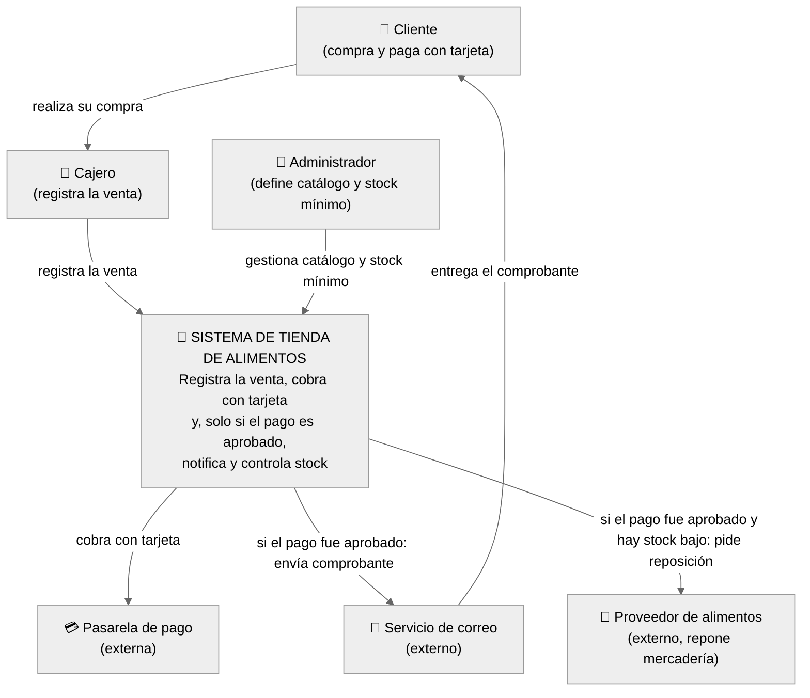
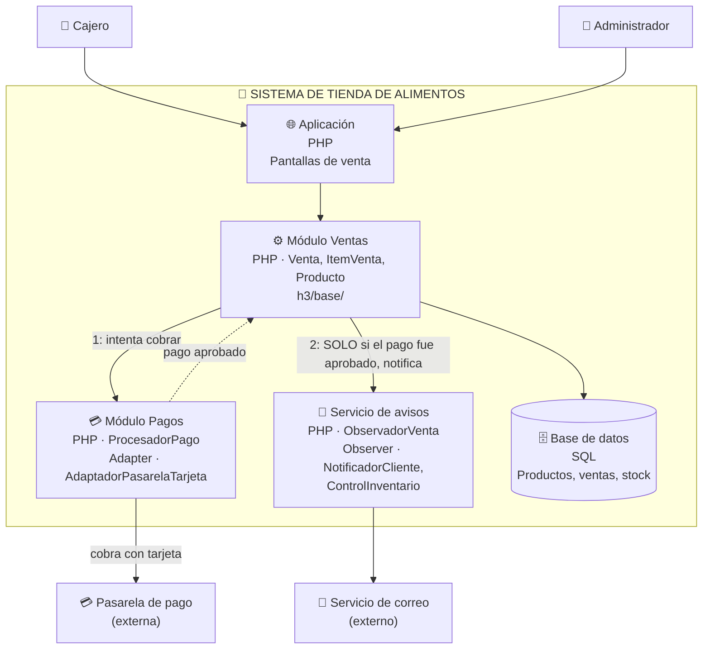

# Modelo C4 — Sistema de Tienda de Alimentos

## Nivel 1 

**La pregunta que responde:** ¿quién usa el sistema y con qué otros sistemas habla?
Las personas que usan el sistema son, personal contratado por la tienda o el mismo dueño que operara el sistema con rol administrador..

## Nivel 2

**La pregunta que responde:** ¿de qué piezas ejecutables/almacenes está hecho el sistema?
Base de Datos, conexion con siat para emitir la facturas a los clientes.

## Cómo se conecta

- **Cobro a los clientes.** `Módulo Pagos` traduce esa llamada hacia la Pasarela externa a través de `AdaptadorPasarelaTarjeta` — exactamente el código de `h3/final/AdaptadorPasarelaTarjeta.php`.

- **Pago aprobados pasa a notificacion"** No es una flecha decorativa: en el código, `Venta::confirmar()` literalmente hace este chequeo antes de llamar a `notificar()`. Si el pago es rechazado, esa segunda flecha nunca se dispara — ni el Cliente recibe comprobante, ni el Proveedor recibe pedido de reposición.

- **Los dos niveles usan el mismo lenguaje que el código** "Módulo Pagos", "Servicio de avisos" y "Módulo Ventas" no son nombres inventados para el diagrama — son, literalmente, cómo se llaman las responsabilidades dentro de Venta.php, AdaptadorPasarelaTarjeta.php y los observadores. Cualquiera que lea el código reconoce las mismas piezas en el dibujo..

- **El orden de las cajas en el Nivel 2 es el orden real de ejecución.** Ventas -> Pagos -> Pasarela y despues Ventas -> Avisos -> Correo no es un orden decorativo: es exactamente la secuencia de Venta::confirmar() en h3/final/Venta.php -- primero se cobra, despues (solo si se aprobo) se notifica. El diagrama se puede leer de arriba hacia abajo como si fuera el propio metodo.