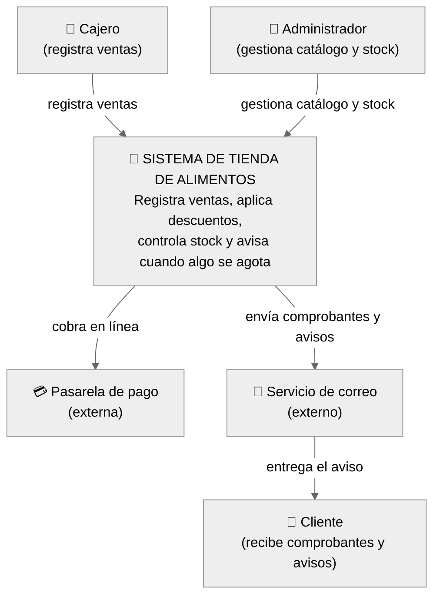

# Modelo C4 — Sistema de Tienda de Alimentos

## Nivel 1 — Contexto (el sistema y su mundo)

**La pregunta que responde:** ¿quién usa el sistema y con qué otros sistemas habla?
Una caja para MI sistema; personas y sistemas externos alrededor. Nada de detalles internos.

## Elementos de este nivel

| Elemento | Tipo | Rol |
|---|---|---|
| Cajero | Persona | Registra las ventas del día a día |
| Administrador | Persona | Gestiona catálogo de productos y ajusta stock/precios |
| Sistema de Tienda de Alimentos | MI sistema | La caja única — todavía no se abre |
| Pasarela de pago | Sistema externo | Cobra pagos con tarjeta (resuelto con Adapter en `con-adapter/`) |
| Servicio de correo | Sistema externo | Entrega los comprobantes y alertas de stock |
| Cliente | Persona | Recibe el comprobante de su compra y avisos |

**Regla de oro del nivel 1:** si aparece una base de datos o un módulo interno, ya me pasé de zoom — eso es Nivel 2.