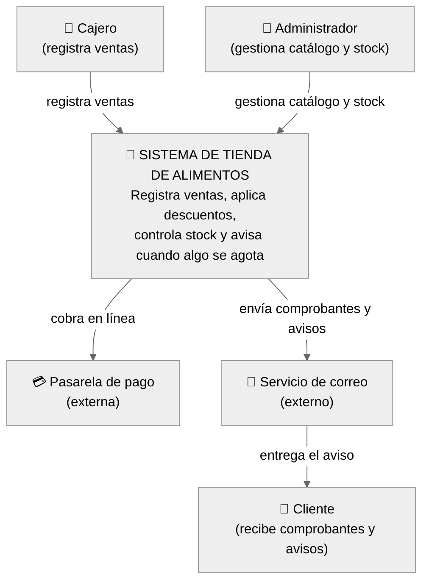
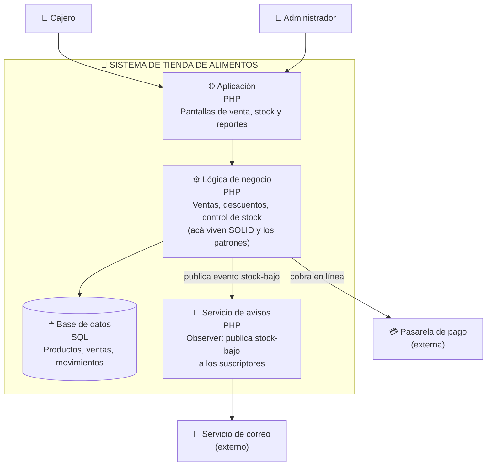

# Modelo C4 — Sistema de Tienda de Alimentos

## Nivel 1 — Contexto (el sistema y su mundo)

**La pregunta que responde:** ¿quién usa el sistema y con qué otros sistemas habla?
Una caja para MI sistema; personas y sistemas externos alrededor. Nada de detalles internos.

---

## Nivel 2 — Contenedores (el zoom adentro del sistema) — *borrador*

*Nota: este nivel es un borrador. El curso no exige bajar a nivel 3-4 (componentes/clases individuales) — esa parte ya está resuelta como código en `h3/`.*

**La pregunta que responde:** ¿de qué piezas ejecutables/almacenes está hecho el sistema?
Cada contenedor es algo que corre o almacena: la app, la base de datos, un servicio.

